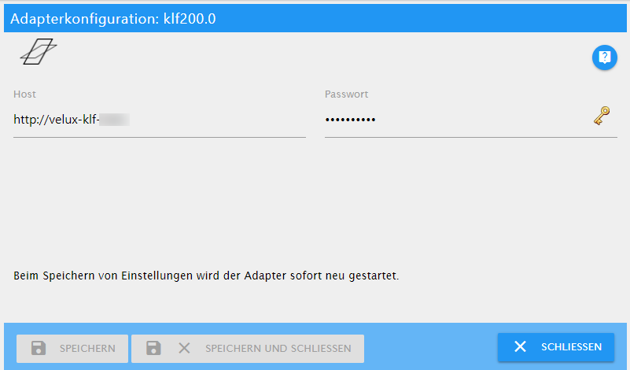

# KLF-200 Adapter Dokumentation

Dieser Adapter dient zur Steuerung einer VELUX® KLF-200-Schnittstelle. Dieser Adapter ist weder ein offizielles VELUX Produktnoch wird er von der Firma unterstützt, die die VELUX-Produkte besitzt.

Die Hauptabsicht dieses Adapters besteht darin, elektrische Dachfenster und/oder elektrische Jalousien oder Rollläden zu steuern. Obwohl die KLF-200-Schnittstelle mit weiteren Geräten wie Lampen, Schaltern, Jalousien usw. verbunden werden kann, habe ich den Adapter nicht für die Verwendung mit solchen Geräten getestet. Es sollte jedoch möglich sein, dass diese Geräte auch von diesem Adapter gesteuert werden können.

Der Adapter funktioniert mit der offiziellen TCP/IP-Schnittstelle des KLF-200, die mit der Veröffentlichung der Firmware-Version 2.0.0.71 dokumentiert wurde. Sie müssen die Ein- und Ausgänge des KLF-200 nicht verkabeln, aber Sie müssen den KLF-200 über ein Ethernet-Kabel mit einem LAN verbinden.

---

## Bereiten Sie Ihre KLF-200-Schnittstelle vor

Um diesen Adapter verwenden zu können, müssen Sie Ihre KLF-200 im **Schnittstellenmodus** einrichten. Es funktioniert nicht, wenn Sie Ihre KLF-200 als Repeater verwenden.

Der Adapter funktioniert nur über den LAN-Port Ihres KLF-200.

> Für eine detaillierte Erklärung der folgenden Aufgaben lesen Sie bitte die mit der Box mitgelieferten Handbücher.
> Es wird davon ausgegangen, dass Sie sich in einem Webbrowser erfolgreich bei Ihrer Box angemeldet haben.

### Produkte einrichten

Jedes Produkt, das Sie mit diesem Adapter steuern möchten, muss auf der Seite "Meine Produkte" registriert sein. Sie können neue Produkte registrieren entweder durch

- Kopieren von einer anderen Fernbedienung
- Suche nach Produkten

Wenn alle Ihre Produkte registriert sind, sollten Sie eine Liste wie die folgende sehen:


### Szenen einrichten

> **Wichtige Änderungen:**
> **Mit der neuen Firmware müssen Sie nicht mehr für jede gewünschte Produktposition eine Szene definieren.**

Dieser Schritt ist optional. Sie können Szenen aufzeichnen, um verschiedene Produkte in einem Schritt zu ändern. Sie können beispielsweise eine Szene definieren, um alle Fenster zu schließen.

Um eine Szene aufzunehmen, klicken Sie auf die Schaltfläche


Dies öffnet das Fenster *Programmerstellung in Bearbeitung*. Verwenden Sie jetzt die mit Ihrem Produkt gelieferte Fernbedienung, um etwas zu ändern, z.B. öffne das Fenster zu 40%. Geben Sie dann einen Namen für das Programm ein und klicken Sie auf *Programm speichern*.


> TIPP:
> - Geben Sie Ihrem Programm einen aussagekräftigen Namen, obwohl der Adapter keine Namenskonventionen verwendet.

Wenn Sie mit der Aufnahme von Programmen fertig sind, erhalten Sie eine Liste wie folgt:


### Verbindungen einrichten

Dieser letzte Schritt ist optional. Wenn Sie die Eingangs- und Ausgangsleitungen nicht verwenden, haben Sie vielleicht bemerkt, dass die kleine LED an der Box ständig blinkt. Um das lästige Blinken loszuwerden, müssen Sie mindestens eine Verbindung einrichten.

Sie müssen es nur in der Box einrichten, Sie müssen nichts verkabeln! Wählen Sie einfach irgendetwas aus.

---

## Konfigurieren Sie den Adapter



### Host

Hostname Ihrer KLF-200-Schnittstelle. Dies ist die gleiche Adresse, die Sie in der Adressleiste Ihres Webbrowsers zum Verbinden mit Ihrer Box eintragen.

### Passwort

Das Passwort, das Sie für die Verbindung mit Ihrer KLF-200-Schnittstelle benötigen. Es ist das gleiche, das Sie bei der Verbindung in Ihrem Webbrowser verwenden.

> Das Standardkennwort des KLF-200 befindet sich auf der Rückseite des Geräts, aber Sie sollten es ändern!

---

## Benutzung des Adapters

Nachdem der Adapter die Metadaten von der KLF-200-Schnittstelle gelesen hat, finden Sie die folgenden Zustände im Objektbaum:

Gerät | Kanal | Zustand | Datentyp | Beschreibung
--- | --- | --- | --- | ---
gateway |  |  |  | Zeigt allgemeine Daten von der KLF-200-Schnittstelle selbst an, wie z.B. Versionsnummern und aktueller Status.
gateway |  | GatewayState | value | Konfigurationsstatus des KLF-200. Der KLF-200 kann als Gateway zur Steuerung registrierter Produkte oder als Repeater zur Erweiterung der Reichweite physischer Fernbedienungen verwendet werden. Dieser Adapter funktioniert mit dem KLF-200 im Gateway-Modus. Es wurde nicht mit einem KLF-200 im Repeater-Modus getestet. Nachdem Sie Ihren KLF-200 eingerichtet und Ihre Produkte registriert haben, sollte dieser Status GatewayMode_WithActuatorNodes sein.
gateway |  | GatewaySubState | value | Dieser Status zeigt an, ob das Gateway derzeit inaktiv ist oder einen Befehl oder eine Szene ausführt oder ob es sich derzeit im Konfigurationsmodus befindet.
gateway |  | HardwareVersion | value | Versionsnummer der Hardwareversion des KLF-200.
gateway |  | ProductGroup | value | Produktgruppe des KLF-200 selbst. Es ist ein Fernbedienungsgerät und daher ist der Wert immer 14.
gateway |  | ProductType | value | Produkttyp des KLF-200 selbst. Dieser Wert ist immer 3.
gateway |  | ProtocolVersion | value | Versionsnummer des Protokolls, mit dem der Adapter mit dem Gerät kommuniziert.
gateway |  | SoftwareVersion | value | Versionsnummer der Firmware.
groups |  |  |  | Hat für jede Benutzergruppe einen entsprechenden Kanal definiert.
groups | 0..n |  |  | Kanal für jede Gruppe.
groups | 0..n | groupType | hängt vom Produkt ab | Typ der Gruppe. Eine Benutzergruppe ist eine benutzerdefinierte Gruppe und kann verschiedene Produkte derselben Kategorie enthalten.
groups | 0..n | nodeVariation | value | Definiert die spezielle Art von Fenster: top hung, kip, flat roof, sky light
groups | 0..n | order | value | Benutzerdefinierte Sortierreihenfolge, kann verwendet werden, um die Produkte in Visualisierungen zu sortieren. Dieser Zustand ist beschreibbar.
groups | 0..n | placement | value | Zimmer- oder Hausgruppennummer. Ändern Sie diesen Wert, um das Produkt in einem anderen Raum zu platzieren. Dieser Zustand ist beschreibbar
groups | 0..n | productsCount | value | Anzahl der Produkte, die in der Gruppe enthalten sind.
groups | 0..n | targetPosition | hängt vom Produkt ab | Setzen Sie diesen Status auf einen Wert zwischen 0% und 100%, um eine vollständige Gruppe zu bewegen. Dieser Zustand ist beschreibbar.
groups | 0..n | targetPositionRaw | value | Setzen Sie diesen Status auf einen Wert zwischen 0 und 65535 (0x000 - 0xFFFF), um eine vollständige Gruppe zu bewegen. Dieser Zustand spiegelt den Rohwert der Zielposition wider. Dieser Zustand ist beschreibbar.
groups | 0..n | velocity | value | Geschwindigkeit, mit der die gesamte Gruppe arbeitet. Dieser Zustand ist beschreibbar.
info |  |  |  | Verbindungsstatus zwischen Adapter und KLF-200.
info |  | connection | indicator.connected | Zeigt an, ob der Adapter eine aktive Verbindung zum KLF-200 hat. Wenn die Verbindung unterbrochen wird oder aus irgendeinem Grund nicht hergestellt werden kann, ändert sich dieser Status in false. Während der Initialisierungsphase des Adapters bleibt dieser Status auf false, bis alle Ereignishandler vorhanden sind. Wenn dieser Status true ist, können Befehle ausgeführt und Statuswerte abgefragt werden. Wenn dieser Status falsch ist, haben Sie keine Verbindung zum KLF-200 und Ihre Befehle können nicht empfangen werden. Der von Ihnen abgefragte Status gibt möglicherweise nicht den tatsächlichen Wert für das Produkt wieder. Wenn die Verbindung zum KLF-200 physisch unterbrochen wird, dauert es noch einige Sekunden, bis der Adapter die Informationen erhält. Selbst wenn der Verbindungsstatus wahr ist, besteht also möglicherweise eine geringe Wahrscheinlichkeit, dass Ihre Verbindung bereits unterbrochen ist.
products |  |  |  | Hat für jedes Produkt in der Produktliste des KLF-200 einen Untereintrag.
products |  | productsFound | value | Anzahl der in der Schnittstelle registrierten Produkte
products | 0..n |  |  | Kanal für jedes registrierte Produkt
products | 0..n | FP1CurrentPositionRaw | value | Rohpositionswert des Funktionsparameters 1; Die Rohwerte liegen im Bereich von 0-65535.
products | 0..n | FP2CurrentPositionRaw | value | Rohpositionswert des Funktionsparameters 2; Die Rohwerte liegen im Bereich von 0-65535
products | 0..n | FP3CurrentPositionRaw | value | Rohpositionswert des Funktionsparameters 3; Die Rohwerte liegen im Bereich von 0-65535
products | 0..n | FP4CurrentPositionRaw | value | Rohpositionswert des Funktionsparameters 4; Die Rohwerte liegen im Bereich von 0-65535
products | 0..n | category | hängt vom Produkt ab | Kategoriebezeichnung, z.B. Window Opener, Roller Shutter
products | 0..n | currentPosition | hängt vom Produkt ab | aktuelle Position des Produkts in Prozent; In der Regel bedeutet 0%, dass das Fenster geschlossen ist, der Rollladen geschlossen ist, das Licht aus ist usw. Basierend auf dem Rohwert und der Produktkategorie wird der Wert entsprechend berechnet.
products | 0..n | currentPositionRaw | value | Aktuelle Position des Produkts als Rohwert
products | 0..n | nodeVariation | value | Definiert die spezielle Art von Fenster: top hung, kip, flat root, sky light
products | 0..n | order | value | Benutzerdefinierte Sortierreihenfolge, kann verwendet werden, um die Produkte in Visualisierungen zu sortieren. Dieser Zustand ist beschreibbar.
products | 0..n | placement | value | Zimmer- oder Hausgruppennummer. Ändern Sie diesen Wert, um das Produkt einem anderen Raum zuzuweisen. Dieser Zustand ist beschreibbar.
products | 0..n | powerSaveMode | value | Art des Energiesparmodus des Produkts.
products | 0..n | productType | value | Art des Produkts. Die Nummern sind nicht dokumentiert, daher zeigt der Adapter die Werte an, wie sie sind.
products | 0..n | remainingTime | value | Verbleibende Zeit des aktuellen Vorgangs des Produkts in Sekunden. Derzeit wird dies nur zu Beginn und am Ende einer Produktbewegung aktualisiert.
products | 0..n | runStatus | value | Ausführungsstatus, mögliche Werte sind ExecutionCompleted, ExecutionFailed oder ExecutionActive.
products | 0..n | serialNumber | value | Seriennummer des Produkts.
products | 0..n | state | value | Der Betriebszustand des Produkts. Kann die folgenden Werte haben: NonExecuting, Error, WaitingForPower, Executing, Done, Unknown
products | 0..n | statusReply | value | Wenn der runStatus eines Ausführungsbefehls fehlgeschlagen ist, enthält dieser Status den Grund.
products | 0..n | stop | button.play | Setzen Sie diesen Status auf true, um einen laufenden Vorgang zu stoppen. Dieser Zustand ist nur beschreibbar.
products | 0..n | subType | value | Abhängig von der Kategorie definiert der Untertyp spezielle Arten oder Fähigkeiten, z. B. für ein Fenster bedeutet eine '1', dass das Fenster einen Regensensor hat.
products | 0..n | targetPosition | hängt vom Produkt ab | Stellen Sie diesen Status auf einen Wert zwischen 0% und 100% ein, um ein Fenster zu bewegen oder ein Licht zu dimmen. Dieser Zustand ist beschreibbar.
products | 0..n | targetPositionRaw | value | Dieser Zustand spiegelt die Zielposition wider, die in einen Rohwert umgewandelt wurde.
products | 0..n | timestamp | value | Zeitstempel der letzten bekannten Position in Ortszeit.
products | 0..n | typeID | value | Produkttyp, z.B. window, light, roller shutter.
products | 0..n | velocity | value | Geschwindigkeit, mit der das Produkt arbeitet. Die Geschwindigkeit hängt von den physikalischen Fähigkeiten des Produkts ab, z. B. kann sich ein Fenster im Flüster-Modus oder im Fast-Modus bewegen. Die Lichter können mit unterschiedlichen Geschwindigkeiten gedimmt werden. Es kann jedoch auch andere Produkte geben, die ihre Position nur mit einer festen Geschwindigkeit ändern.
products | 0..n | wink | button.play | Setzen Sie diesen Status auf true, damit das Produkt sich bemerkbar macht. Dies wird verwendet, um ein Gerät zu identifizieren, z. B. bewegt ein Fenster seinen Griff, ein Rollladen bewegt sich ein wenig auf und ab. Dieser Zustand ist nur beschreibbar.
scenes |  |  |  | Hat für jedes Produkt in der Produktliste des KLF-200 einen Untereintrag.
scenes |  | scenesFound | value | Die Anzahl der Szenen in der Liste. Schreibgeschützt.
scenes | 0..n | productsCount | value | Anzahl der Produkte in dieser Szene. Schreibgeschützt.
scenes | 0..n | run | button.play | Setzen Sie diesen Status auf true, um die Szene auszuführen. Wenn eine Szene ausgeführt wird, wird dieser Status auf true gesetzt.
scenes | 0..n | stop | button.play | Setzen Sie diesen Status, um eine laufende Szene zu stoppen. Dieser Wert ist nur beschreibbar.

> **WICHTIG:**
> Die IDs, die in den Kanälen verwendet werden, sind die IDs, die von der KLF-200-Schnittstelle kommen. Wenn Sie Änderungen an der Produktliste oder an der Programmliste in Ihrem KLF-200 vornehmen, können sich die IDs ändern.

Um eine Szene auszuführen, können Sie den Status `run` der Szene auf `true` setzen oder den Status `level` des Produkts auf einen Wert setzen, der einer Szene entspricht, die das Produkt auf dieses Level setzt.

### Beispiele

Angenommen, Ihr Badezimmerfenster ist Kanal `0`. Sie haben eine Szene auf Kanal `10` definiert, die alle Fenster schließt.

```javascript
// Example 1: Open the bathroom window at 40%: await setStateAsync("klf200.0.products.0.targetPosition", 40); /*      The following will happen:     1. Several states will be changed to reflect the current operation, e.g. the remainingTime.     2. Your window will start to move to 40% opening level. (If it's not blocked, e.g. by the rain sensor.)     3. After your window has stopped (for whatever reason), several states will be changed again, including the currentPosition. */  // Example 2: Close all windows by running scene 10: await setStateAsync("klf200.0.scenes.10.run", true); /*     The following will happen:     1. All related products will receive updates to their states to reflect the current operation.     2. All windows will start to move to 0% openening level.     3. After the scene has finished, the run state is set to false, again. */
```

---

## Bekannte Einschränkungen

- Wenn Sie neue Szenen im Gerät definieren, müssen Sie den Adapter neu starten, um die neuen Szenen zu lesen.
- Die Zeitzone ist auf die mitteleuropäische Zeit festgelegt (GMT+1/GMT+2 für die Sommerzeit).

---

VELUX und das VELUX-Logo sind eingetragene Warenzeichen der VKR Holding A/S.
