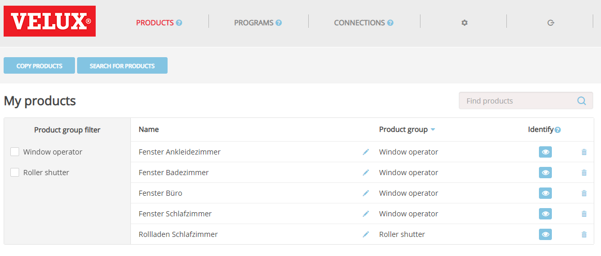
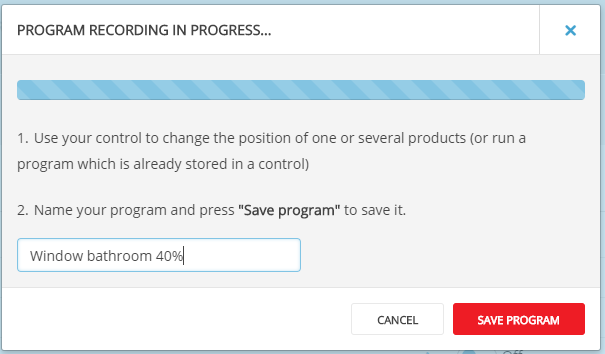
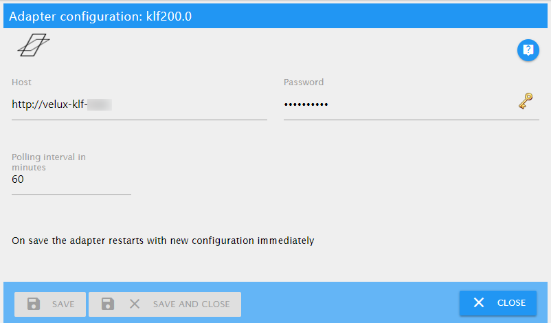

# KLF-200 adapter documentation

This adapter is for controlling a VELUX® KLF-200 interface. This adapter is neither an official VELUX product nor is it supported by the company that owns the VELUX products.

The main intention of this adapter is to control electric roof windows and/or electric blinds or roller shutters. Though the KLF-200 interface is able to connect to further devices like lights, switches, canvas blinds etc. I haven't tested the adapter for use with these kind of devices. Thus, it should be possible, that these devices could be controlled by this adapter, too.

The adapter works with the official TCP/IP interface of the KLF-200 that was documented with the release of firmware version 2.0.0.71. You don't need to wire the inputs and outputs of the box, but you have to
connect the KLF-200 to a LAN using an ethernet cable.

---

## Prepare your KLF-200 interface

To use this adapter you have to setup your KLF-200 box in the **interface mode**. It doesn't work if you use your box as a repeater.

The adapter will only work over the LAN port of your KLF-200.

> For a detailed explanation of how to accomplish the following tasks please read the manuals that came with your box.
>
> It is assumed that you have successfully logged into your box in a web browser.

### Setup products

Each product that you want to control by this adapter has to be registered on the "My products" page. You can register new products either by

-   Copy from another remote control
-   Search for products

If all of your products are registered you should see a list like the following:



### Setup scenes

> **Breaking changes:**
>
> **With the new firmware you no longer need to define a scene for each desired product state.**

This step is optional. You can record scenes to change different products with one step,
e.g. you can define a scene to close all windows.

To record a scene you have to click on the button


This will open the _Recording in progress_ window. Now, use your remote control that comes with your product to change something, e.g. open the window to 40%. Then type in a name for the program and click on _Save program_.



> HINT:
>
> -   Give your program a meaningful name, though the adapter doesn't use any naming conventions.

If you have finished recording programs you will end with a list like the following:


### Setup connections

This last step is optional. If you don't use the input and output wires you may have noticed that the tiny LED on the box is flashing all the time. To get rid of the annoying flashing you have to setup at least one connection.

You only have to set it up in the box you don't need to wire anything! Just choose anything you like.

---

## Configure the adapter



### Host

Host name of your KLF-200 interface. This is the same you type into the address bar of your web browser to connect to your box.

### Password

The password you need to connect to your KLF-200 interface. It's the same you use when connecting to your box in your web browser.

> The default password of the KLF-200 is written on the backside of the device, but you should have changed it, anyway!

---

## Use the adapter

After the adapter has read the meta data from the KLF-200 interface you will find the following states in the object tree:

| Device   | Channel | State                 | Data type              | Description                                                                                                                                                                                                                                                                                                                                                                                                                                                                                                                                                                                                                                                                                                                                                                           |
| -------- | ------- | --------------------- | ---------------------- | ------------------------------------------------------------------------------------------------------------------------------------------------------------------------------------------------------------------------------------------------------------------------------------------------------------------------------------------------------------------------------------------------------------------------------------------------------------------------------------------------------------------------------------------------------------------------------------------------------------------------------------------------------------------------------------------------------------------------------------------------------------------------------------- |
| gateway  |         |                       |                        | Shows global data from the KLF-200 interface itself, like version numbers and current status.                                                                                                                                                                                                                                                                                                                                                                                                                                                                                                                                                                                                                                                                                         |
| gateway  |         | GatewayState          | value                  | Configuration state of the KLF-200. The KLF-200 can operate as a gateway to control registered products or as a repeater to extend the range of physical remote controls. This adapter is supposed to work with the KLF-200 in gateway mode. It wasn't tested with a KLF-200 in repeater mode. After you have setup your KLF-200 and you have registered you products this state should be GatewayMode_WithActuatorNodes.                                                                                                                                                                                                                                                                                                                                                             |
| gateway  |         | GatewaySubState       | value                  | This state shows if the gateway is currently idle or if it's running a command, a scene of if it's currently in a configuration mode.                                                                                                                                                                                                                                                                                                                                                                                                                                                                                                                                                                                                                                                 |
| gateway  |         | HardwareVersion       | value                  | Version number of the hardware release of the KLF-200.                                                                                                                                                                                                                                                                                                                                                                                                                                                                                                                                                                                                                                                                                                                                |
| gateway  |         | ProductGroup          | value                  | Product Group of the KLF-200 itself. It's a remote control device and therefore its product group value is always 14.                                                                                                                                                                                                                                                                                                                                                                                                                                                                                                                                                                                                                                                                 |
| gateway  |         | ProductType           | value                  | Product type of the KLF-200 itself. It's always 3.                                                                                                                                                                                                                                                                                                                                                                                                                                                                                                                                                                                                                                                                                                                                    |
| gateway  |         | ProtocolVersion       | value                  | Version number of the protocol with which the adapter communicates with the device.                                                                                                                                                                                                                                                                                                                                                                                                                                                                                                                                                                                                                                                                                                   |
| gateway  |         | SoftwareVersion       | value                  | Version number of the firmware.                                                                                                                                                                                                                                                                                                                                                                                                                                                                                                                                                                                                                                                                                                                                                       |
| groups   |         |                       |                        | Has a corresponding channel for each user group defined.                                                                                                                                                                                                                                                                                                                                                                                                                                                                                                                                                                                                                                                                                                                              |
| groups   | 0..n    |                       |                        | Channel for each group.                                                                                                                                                                                                                                                                                                                                                                                                                                                                                                                                                                                                                                                                                                                                                               |
| groups   | 0..n    | groupType             | depends on the product | Type of the group. A UserGroup is a user defined group and can contain different products of the same category.                                                                                                                                                                                                                                                                                                                                                                                                                                                                                                                                                                                                                                                                       |
| groups   | 0..n    | nodeVariation         | value                  | Defines the special kind of window like top hung, kip, flat roof, sky light                                                                                                                                                                                                                                                                                                                                                                                                                                                                                                                                                                                                                                                                                                           |
| groups   | 0..n    | order                 | value                  | Custom sort order, can be used to sort the products in visualisations. This state is writable.                                                                                                                                                                                                                                                                                                                                                                                                                                                                                                                                                                                                                                                                                        |
| groups   | 0..n    | placement             | value                  | Room or house group number. Change this to put the product in another room. This state is writable                                                                                                                                                                                                                                                                                                                                                                                                                                                                                                                                                                                                                                                                                    |
| groups   | 0..n    | productsCount         | value                  | Number of products that are contained in the group.                                                                                                                                                                                                                                                                                                                                                                                                                                                                                                                                                                                                                                                                                                                                   |
| groups   | 0..n    | targetPosition        | depends on the product | Set this state to a value between 0% and 100% to move a complete group. This state is writable.                                                                                                                                                                                                                                                                                                                                                                                                                                                                                                                                                                                                                                                                                       |
| groups   | 0..n    | targetPositionRaw     | value                  | Set this state to a value between 0 and 65535 (0x000 - 0xFFFF) to move a complete group. This state reflects the raw value of the target position. This state is writable.                                                                                                                                                                                                                                                                                                                                                                                                                                                                                                                                                                                                            |
| groups   | 0..n    | velocity              | value                  | Velocity at which the whole group operates. This state is writable.                                                                                                                                                                                                                                                                                                                                                                                                                                                                                                                                                                                                                                                                                                                   |
| info     |         |                       |                        | Connection state between the adapter and the KLF-200.                                                                                                                                                                                                                                                                                                                                                                                                                                                                                                                                                                                                                                                                                                                                 |
| info     |         | connection            | indicator.connected    | Indicates if the adapter has an active connection to the KLF-200. If the connection is lost or can not be established for whatever reason this state will change to false. During the initialization phase of the adapter this state stays at false until all event handlers are in place. If this state is true it's safe to run commands and query states. If this state is false you don't have a connection to the KLF-200 and your commands can't be received and states that you query may not reflect the real value for the product. If the connection to the KLF-200 is lost physically it still takes a few seconds until the adapter gets the information, thus even if the connection state is true there might be a slight chance that your connection is lost, already. |
| products |         |                       |                        | Has a sub-entry for each product found in the product list of the KLF-200.                                                                                                                                                                                                                                                                                                                                                                                                                                                                                                                                                                                                                                                                                                            |
| products |         | productsFound         | value                  | Number of products registered in the interface                                                                                                                                                                                                                                                                                                                                                                                                                                                                                                                                                                                                                                                                                                                                        |
| products | 0..n    |                       |                        | Channel for each registered product                                                                                                                                                                                                                                                                                                                                                                                                                                                                                                                                                                                                                                                                                                                                                   |
| products | 0..n    | FP1CurrentPositionRaw | value                  | Raw position value of the functional parameter 1; the raw values is in the range of 0-65535.                                                                                                                                                                                                                                                                                                                                                                                                                                                                                                                                                                                                                                                                                          |
| products | 0..n    | FP2CurrentPositionRaw | value                  | Raw position value of the functional parameter 2; the raw values is in the range of 0-65535                                                                                                                                                                                                                                                                                                                                                                                                                                                                                                                                                                                                                                                                                           |
| products | 0..n    | FP3CurrentPositionRaw | value                  | Raw position value of the functional parameter 3; the raw values is in the range of 0-65535                                                                                                                                                                                                                                                                                                                                                                                                                                                                                                                                                                                                                                                                                           |
| products | 0..n    | FP4CurrentPositionRaw | value                  | Raw position value of the functional parameter 4; the raw values is in the range of 0-65535                                                                                                                                                                                                                                                                                                                                                                                                                                                                                                                                                                                                                                                                                           |
| products | 0..n    | category              | depends on the product | Name of the category, e.g. Window Opener, Roller Shutter                                                                                                                                                                                                                                                                                                                                                                                                                                                                                                                                                                                                                                                                                                                              |
| products | 0..n    | currentPosition       | depends on the product | current position of the product in percent; usually, 0% means window closed, roller shutter up, lights out etc. Based on the raw value and the product category the value is calculated accordingly.                                                                                                                                                                                                                                                                                                                                                                                                                                                                                                                                                                                  |
| products | 0..n    | currentPositionRaw    | value                  | Current position of the product as raw value                                                                                                                                                                                                                                                                                                                                                                                                                                                                                                                                                                                                                                                                                                                                          |
| products | 0..n    | nodeVariation         | value                  | Defines the special kind of window like top hung, kip, flat roof, sky light                                                                                                                                                                                                                                                                                                                                                                                                                                                                                                                                                                                                                                                                                                           |
| products | 0..n    | order                 | value                  | Custom sort order, can be used to sort the products in visualisations. This state is writable.                                                                                                                                                                                                                                                                                                                                                                                                                                                                                                                                                                                                                                                                                        |
| products | 0..n    | placement             | value                  | Room or house group number. Change this to put the product in another room. This state is writable.                                                                                                                                                                                                                                                                                                                                                                                                                                                                                                                                                                                                                                                                                   |
| products | 0..n    | powerSaveMode         | value                  | Kind of power save mode of the product.                                                                                                                                                                                                                                                                                                                                                                                                                                                                                                                                                                                                                                                                                                                                               |
| products | 0..n    | productType           | value                  | Type of the product. The numbers are not documented, thus the adapter shows the raw numbers.                                                                                                                                                                                                                                                                                                                                                                                                                                                                                                                                                                                                                                                                                          |
| products | 0..n    | remainingTime         | value                  | Remaining time of the current operation of the product in seconds. Currently, this is only updated at the beginning and at the end of a products movement.                                                                                                                                                                                                                                                                                                                                                                                                                                                                                                                                                                                                                            |
| products | 0..n    | runStatus             | value                  | Execution status, possible values are ExecutionCompleted, ExecutionFailed or ExecutionActive.                                                                                                                                                                                                                                                                                                                                                                                                                                                                                                                                                                                                                                                                                         |
| products | 0..n    | serialNumber          | value                  | Serial number of the product.                                                                                                                                                                                                                                                                                                                                                                                                                                                                                                                                                                                                                                                                                                                                                         |
| products | 0..n    | state                 | value                  | The operating state of the product. Can have the following values: NonExecuting, Error, WaitingForPower, Executing, Done, Unknown                                                                                                                                                                                                                                                                                                                                                                                                                                                                                                                                                                                                                                                     |
| products | 0..n    | statusReply           | value                  | If the runStatus of an execution command has failed this state contains the reason.                                                                                                                                                                                                                                                                                                                                                                                                                                                                                                                                                                                                                                                                                                   |
| products | 0..n    | stop                  | button.play            | Set this state to true to stop a running operation. This state is writable, only.                                                                                                                                                                                                                                                                                                                                                                                                                                                                                                                                                                                                                                                                                                     |
| products | 0..n    | subType               | value                  | Depending on the category the sub type defines special kinds or capabilities, e.g. for a window a '1' means that the window has a rain sensor.                                                                                                                                                                                                                                                                                                                                                                                                                                                                                                                                                                                                                                        |
| products | 0..n    | targetPosition        | depends on the product | Set this state to a value between 0% and 100% to move a window or to dim a light. This state is writable.                                                                                                                                                                                                                                                                                                                                                                                                                                                                                                                                                                                                                                                                             |
| products | 0..n    | targetPositionRaw     | value                  | This state reflects the target position converted to a raw value.                                                                                                                                                                                                                                                                                                                                                                                                                                                                                                                                                                                                                                                                                                                     |
| products | 0..n    | timestamp             | value                  | Timestamp of the last known position in local time.                                                                                                                                                                                                                                                                                                                                                                                                                                                                                                                                                                                                                                                                                                                                   |
| products | 0..n    | typeID                | value                  | Type of the product, e.g. window, light, roller shutter.                                                                                                                                                                                                                                                                                                                                                                                                                                                                                                                                                                                                                                                                                                                              |
| products | 0..n    | velocity              | value                  | Velocity at which the product operates. The velocity depends on the physical capabilites of the product, e.g. a window can move in silend mode or in fast mode, lights may dim at different velocities, but there may be other products which change their position only with a fixed speed.                                                                                                                                                                                                                                                                                                                                                                                                                                                                                          |
| products | 0..n    | wink                  | button.play            | Set this state to true to let the product wink. This is used to identify a device, e.g. a window will move its handle, a roller shutter will move up and down a little bit. This state is writable, only.                                                                                                                                                                                                                                                                                                                                                                                                                                                                                                                                                                             |
| scenes   |         |                       |                        | Has a sub-entry for each scene found in the program list of the KLF-200.                                                                                                                                                                                                                                                                                                                                                                                                                                                                                                                                                                                                                                                                                                              |
| scenes   |         | scenesFound           | value                  | The number of scenes in the list. Read-only.                                                                                                                                                                                                                                                                                                                                                                                                                                                                                                                                                                                                                                                                                                                                          |
| scenes   | 0..n    | productsCount         | value                  | Number of products in this scene. Read-only.                                                                                                                                                                                                                                                                                                                                                                                                                                                                                                                                                                                                                                                                                                                                          |
| scenes   | 0..n    | run                   | button.play            | Set this state to true to run the scene. If a scene is running this state is set to true.                                                                                                                                                                                                                                                                                                                                                                                                                                                                                                                                                                                                                                                                                             |
| scenes   | 0..n    | stop                  | button.play            | Set this state to stop a running scene. This state is writable, only.                                                                                                                                                                                                                                                                                                                                                                                                                                                                                                                                                                                                                                                                                                                 |

> **IMPORTANT:**
>
> The IDs that are used in the channels are the IDs coming from the KLF-200 interface. If you make changes at the products list or at the program list in your KLF-200 the IDs may change.

To run a scene you can either set the `run` state of the scene to `true` or you can set the `level` state of the product to a value that corresponds to a scene that sets the product to that level.

### Examples

Assuming your bathroom window is channel `0`.
You have a scene on Channel `10` that closes all windows.

```javascript
// Example 1: Open the bathroom window at 40%:
await setStateAsync("klf200.0.products.0.targetPosition", 40);
/* 
    The following will happen:
    1. Several states will be changed to reflect the current operation, e.g. the remainingTime.
    2. Your window will start to move to 40% opening level. (If it's not blocked, e.g. by the rain sensor.)
    3. After your window has stopped (for whatever reason), several states will be changed again, including the currentPosition.
*/

// Example 2: Close all windows by running scene 10:
await setStateAsync("klf200.0.scenes.10.run", true);
/*
    The following will happen:
    1. All related products will receive updates to their states to reflect the current operation.
    2. All windows will start to move to 0% openening level.
    3. After the scene has finished, the run state is set to false, again.
*/
```

---

## Known limitations

-   If you define new scenes in the device you have to restart the adapter to read the new scenes.
-   The timezone is fixed to Central European Time (GMT+1/GMT+2 for daylight saving time).

---

VELUX and the VELUX logo are registered trademarks of VKR Holding A/S.
