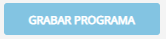
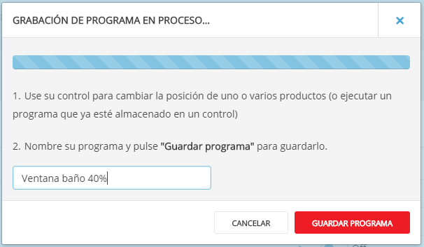
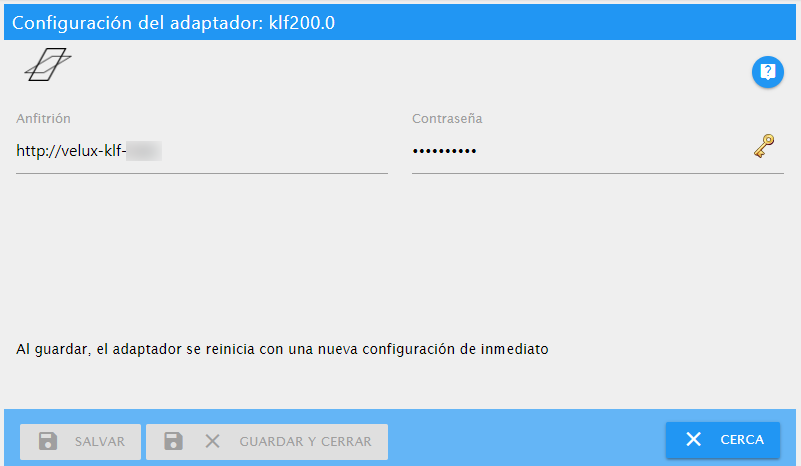

# Documentación del adaptador KLF-200

Este adaptador es para controlar una interfaz VELUX® KLF-200. Este adaptador no es un producto oficial VELUX ni es compatible con la empresa propietaria de los productos VELUX.

La intención principal de este adaptador es controlar las ventanas eléctricas del techo y / o persianas eléctricas o persianas enrollables.
Aunque la interfaz KLF-200 puede conectarse a otros dispositivos como luces, interruptores, persianas de lona, etc. No he desarrollado el adaptador para usar con este tipo de dispositivos. Por lo tanto, podría ser posible que estos dispositivos también pudieran controlarse con este adaptador.

El adaptador funciona con la API REST interna de la interfaz KLF-200 y no es necesario conectar las entradas y salidas de la caja, aunque aún es posible usarlas en paralelo.

---

## Prepare su interfaz KLF-200

Para usar este adaptador, debe configurar su caja KLF-200 en el **modo de interfaz**. No funciona si usa su caja como repetidor.

> Para una explicación detallada de cómo realizar las siguientes tareas, lea los manuales que vienen con su caja.
>
> Se supone que ha iniciado sesión correctamente en su cuadro en un navegador web.

### Configurar productos

Cada producto que desee controlar mediante este adaptador debe registrarse en la página "Mis productos". Puede registrar nuevos productos ya sea por

- Copiar desde otro control remoto
- Buscar productos

Si todos sus productos están registrados, debería ver una lista como la siguiente:


### Escenas de configuración

Para grabar una escena, debes hacer clic en el botón



Esto abrirá la ventana *Grabación en proceso*. Ahora, use su control remoto que viene con su producto para cambiar algo, p. abre la ventana al 40%. Luego escriba un nombre para el programa y haga clic en *Guardar programa*.



> INSINUACIÓN:
> - Asigne un nombre a su programa después del producto y nivel de apertura, p. Baño de ventana 40%, aunque el adaptador no usa ninguna convención de nomenclatura.
> - Si su ventana está cerrada, comience con un nivel de apertura del 100% y baje con cada programa subsiguiente hasta que llegue al 0%.
> - Usted tiene un máximo de 32 programas que puede guardar en la caja.Por lo tanto, planifique su número de pasos ya que no hay una diferencia real en una ventana abierta en un 30% o 40%.

Si ha terminado de grabar programas, terminará con una lista como la siguiente:


### Configurar conexiones

Este último paso es opcional. Si no usa los cables de entrada y salida, puede haber notado que el pequeño LED en la caja está parpadeando todo el tiempo.
Para deshacerte del molesto parpadeo, debes configurar al menos una conexión.

¡Solo tienes que configurarlo en la caja para que no necesites conectar nada! Solo elige lo que quieras.

---

## Configurar el adaptador



### Anfitrión

Nombre de host de su interfaz KLF-200. Esto es lo mismo que escribe en la barra de direcciones de su navegador web para conectarse a su caja.

### Contraseña

La contraseña que necesita para conectarse a su interfaz KLF-200. Es lo mismo que usa cuando se conecta a su caja en su navegador web.

> La contraseña predeterminada del KLF-200 es `velux123`, ¡pero debería haberla cambiado de todos modos!

### Intervalo de sondeo en minutos

<span style="color: #ff0000"><strong><em>Esta opción está planeada para una versión futura. Si desea volver a cargar la configuración, debe reiniciar el adaptador.</em></strong></span>

La cantidad de minutos después de los cuales el adaptador vuelve a cargar la configuración de la interfaz KLF-200.

---

## Usa el adaptador

Después de que el adaptador haya leído los metadatos de la interfaz KLF-200, encontrará los siguientes estados en el árbol de objetos:

Dispositivo | Canal | Estado | Tipo de datos | Descripción
--- | --- | --- | --- | ---
products |  |  |  | Tiene una entrada secundaria para cada producto que se encuentra en la lista de productos del KLF-200.
products |  | productsFound | value | La cantidad de productos en la lista. Solo lectura.
products | 0..n | category | text | Categoría del producto. Solo lectura.
products | 0..n | level | level | Nivel actual del producto Establecer para ejecutar la escena correspondiente. Leer escribir.
products | 0..n | scenesCount | value | Número de escenas en las que se usa el producto. Solo lectura.
scenes |  |  |  | Tiene una subentrada para cada escena que se encuentra en la lista de programas del KLF-200.
scenes |  | scenesFound | value | El número de escenas en la lista. Solo lectura.
scenes | 0..n | productsCount | value | Número de productos en esta escena Solo lectura.
scenes | 0..n | run | button.play | Indica si la escena se está ejecutando. Establecer para ejecutar la escena. Leer escribir.
scenes | 0..n | silent | indicator.silent | Indica si la escena se ejecuta en modo silencioso (si es compatible con los productos de la escena). Solo lectura.

> **IMPORTANTE:**
>
> Los ID que se usan en los canales son los identificadores que provienen de la interfaz KLF-200. Si realiza cambios en la lista de productos o en la lista de programas en su KLF-200, los ID pueden cambiar.

Para ejecutar una escena, puede establecer el estado `run` de la escena en `true` o puede establecer el estado `level` del producto en un valor eso corresponde a una escena que establece el producto a ese nivel.

### Ejemplo

Suponiendo que la ventana de su baño es el canal `0`. Tienes una escena en el canal `10` que abre la ventana del bañoal 40%.

```javascript
// Variant 1: Open the bathroom window at 40% using the scenes run state:
setState('klf200.0.scenes.10.run', true);
/* 
    The following will happen:
    1. Your window will start to move to 40% opening level.
    2. After your window has stopped, klf200.0.scenes.10.run will be set to 'false' again.
    3. klf200.0.products.0.level will be set to 40%.
*/

// Variant 2: Open the bathroom window at 40% using the products level state:
setState('klf200.0.products.0.level', 40);
/*
    The following will happen:
    1. Your window will start to move to 40% opening level.
    2. klf200.0.scenes.10.run will be set to true.
    3. After your window has stopped, klf200.0.scenes.10.run will be set to 'false' again.
*/

// What happens, if we don't have a scene for that level?
setState('klf200.0.products.0.level', 41);
/*
    The following will happen:
    1. Your window won't move at all!
    2. klf200.0.products.0.level will be reset to the previous value, e.g. 40
*/

```

---

## Limitaciones conocidas

El adaptador controla el KLF-200 utilizando la API REST interna que utiliza la interfaz web de la caja.
Aunque utilizamos solo un subconjunto de la API, existen algunas restricciones:

- El adaptador no puede leer el nivel de apertura actual de una ventana. Si lo controla con su control remoto o se cerrará debido a la lluvia, el adaptador no lo sabe y seguirá mostrando el último valor conocido.
- La interfaz KLF-200 está limitada a un máximo de 32 escenas.
- El adaptador no sabe, cuando una acción ha terminado. El estado de ejecución permanecerá `true` durante al menos 30 segundos.
- No ejecute escenas rápidamente después de la otra. El KLF-200 puede arrojar errores. (Encontrará los errores en el registro).

---

VELUX y el logotipo de VELUX son marcas registradas de VKR Holding A/S.
