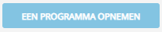
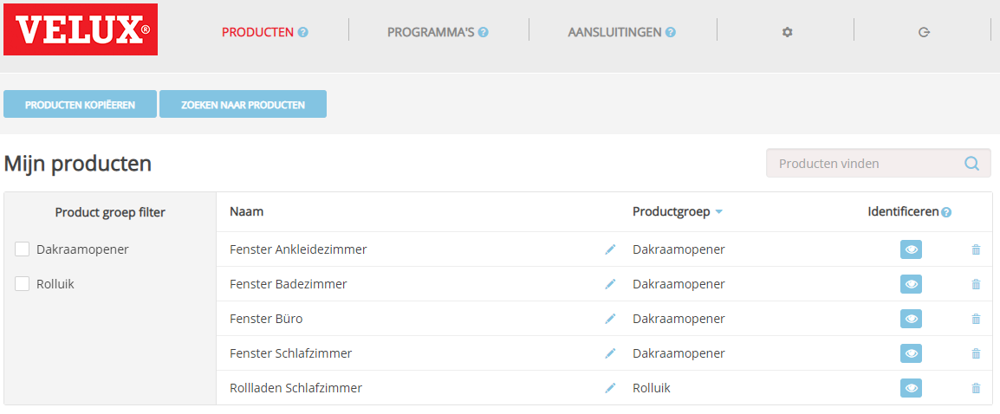

# KLF-200 adapter documentatie

Deze adapter is bedoeld voor het aansturen van een VELUX® KLF-200 interface. Deze adapter is geen officieel VELUX-product en wordt ook niet ondersteund door het bedrijf dat eigenaar is van de VELUX-producten.

Het belangrijkste doel van deze adapter is het bedienen van elektrische dakramen en/of elektrische zonweringen of rolluiken. Hoewel de KLF-200 interface in staat is om verbinding te maken met andere apparaten zoals verlichting, schakelaars, doekzonweringen, enz., heb ik de adapter niet getest voor gebruik met dit soort apparaten. Desalniettemin zou het mogelijk moeten zijn dat ook deze apparaten met deze adapter kunnen worden bediend.

De adapter werkt met de officiële TCP/IP-interface van de KLF-200, die gedocumenteerd is met de release van firmwareversie 2.0.0.71. Je hoeft de ingangen en uitgangen van de box niet aan te sluiten, maar je moet wel de KLF-200 verbinden met een LAN via een ethernetkabel.

---

## Bereid je KLF-200 interface voor

Om deze adapter te gebruiken, moet je je KLF-200 box instellen in de **interface-modus**. Het werkt niet als je je box als repeater gebruikt.

De adapter werkt alleen via de LAN-poort van je KLF-200.

> Lees voor een gedetailleerde uitleg over het uitvoeren van de volgende taken de handleidingen die bij je box zijn geleverd.
>
> Er wordt van uitgegaan dat je met succes bent ingelogd op je box in een webbrowser.

### Scènes instellen

> **Belangrijke wijzigingen:**
>
> **Met de nieuwe firmware hoef je niet langer voor elke gewenste productstatus een scène te definiëren.**

Deze stap is optioneel. Je kunt scènes opnemen om verschillende producten in één stap te wijzigen,
bijvoorbeeld: je kunt een scène definiëren om alle ramen te sluiten.

Om een scène op te nemen, klik je op de knop



Dit opent het _Opname bezig_ venster. Gebruik nu je afstandsbediening die bij je product hoort om iets te veranderen, bijvoorbeeld: open het raam tot 40%. Typ vervolgens een naam voor het programma in en klik op _Programma opslaan_.


> TIP:
>
> -   Geef je programma een zinvolle naam, hoewel de adapter geen naamgevingsconventies gebruikt.

Als je klaar bent met het opnemen van programma's, eindig je met een lijst als de volgende:



### Verbindingen instellen

Deze laatste stap is optioneel. Als je de invoer- en uitvoerdraden niet gebruikt, heb je misschien gemerkt dat het kleine LED-lampje op de box de hele tijd knippert. Om van het vervelende knipperen af te komen, moet je minimaal één verbinding instellen.

Je hoeft het alleen maar in te stellen in de box, je hoeft niets te bedraden! Kies gewoon wat je wilt.

---

## Configureer de adapter


### Host

Hostnaam van je KLF-200 interface. Dit is hetzelfde als wat je invoert in de adresbalk van je webbrowser om verbinding te maken met je box.

### Wachtwoord

Het wachtwoord dat je nodig hebt om verbinding te maken met je KLF-200 interface. Voor nieuwere versies van de KLF-200 is dit het WIFI-wachtwoord dat
geschreven staat op de achterkant van de KLF-200. In het geval dat je de KLF-200 hebt gebruikt met een firmwareversie eerder dan 2.0.0.71
en daarna geüpgraded hebt, is het het wachtwoord dat je hebt gebruikt om in te loggen op de webinterface als je het voor de upgrade hebt gewijzigd.

> Het standaardwachtwoord van de KLF-200 staat op de achterkant van het apparaat, maar je had het sowieso moeten veranderen!

---

## De adapter gebruiken

Nadat de adapter de metadata van de KLF-200 interface heeft gelezen, vind je de volgende statussen in de objectboom:

| Apparaat | Kanaal  | Status                | Gegevenstype           | Beschrijving                                                                                                                                                                                                                                                                                                                                                                                                                                                                                                                                                                                                                                                                                                                                                                          |
| -------- | ------- | --------------------- | ---------------------- | -------------------------------------------------------------------------------------------------------------------------------------------------------------------------------------------------------------------------------------------------------------------------------------------------------------------------------------------------------------------------------------------------------------------------------------------------------------------------------------------------------------------------------------------------------------------------------------------------------------------------------------------------------------------------------------------------------------------------------------------------------------------------------------- |
| gateway  |         |                       |                        | Toont algemene gegevens van de KLF-200 interface zelf, zoals versienummers en huidige status.                                                                                                                                                                                                                                                                                                                                                                                                                                                                                                                                                                                                                                                                                          |
| gateway  |         | GatewayState          | waarde                 | Configuratiestatus van de KLF-200. De KLF-200 kan werken als een gateway om geregistreerde producten te bedienen of als een repeater om het bereik van fysieke afstandsbedieningen te vergroten. Deze adapter is bedoeld om te werken met de KLF-200 in gateway-modus. Het is niet getest met een KLF-200 in repeater-modus. Nadat je je KLF-200 hebt ingesteld en je producten hebt geregistreerd, moet deze status GatewayMode_WithActuatorNodes zijn.                                                                                                                                                                                                                                                                                                                                                              |
| gateway  |         | GatewaySubState       | waarde                 | Deze status toont of de gateway momenteel inactief is of dat er een opdracht, een scène of dat het zich momenteel in een configuratiemodus bevindt.                                                                                                                                                                                                                                                                                                                                                                                                                                                                                                                                                                                                                                   |
| gateway  |         | HardwareVersion       | waarde                 | Versienummer van de hardware-release van de KLF-200.                                                                                                                                                                                                                                                                                                                                                                                                                                                                                                                                                                                                                                                                                                                                 |
| gateway  |         | ProductGroup          | waarde                 | Productgroep van de KLF-200 zelf. Het is een afstandsbedieningsapparaat en daarom is de waarde van de productgroep altijd 14.                                                                                                                                                                                                                                                                                                                                                                                                                                                                                                                                                                                                                                                        |
| gateway  |         | ProductType           | waarde                 | Producttype van de KLF-200 zelf. Het is altijd 3.                                                                                                                                                                                                                                                                                                                                                                                                                                                                                                                                                                                                                                                                                                                                     |
| gateway  |         | ProtocolVersion       | waarde                 | Versienummer van het protocol waarmee de adapter communiceert met het apparaat.                                                                                                                                                                                                                                                                                                                                                                                                                                                                                                                                                                                                                                                                                                      |
| gateway  |         | SoftwareVersion       | waarde                 | Versienummer van de firmware.                                                                                                                                                                                                                                                                                                                                                                                                                                                                                                                                                                                                                                                                                                                                                        |
| groepen  |         |                       |                        | Heeft een overeenkomstig kanaal voor elke gedefinieerde gebruikersgroep.                                                                                                                                                                                                                                                                                                                                                                                                                                                                                                                                                                                                                                                                                                             |
| groepen  | 0..n    |                       |                        | Kanaal voor elke groep.                                                                                                                                                                                                                                                                                                                                                                                                                                                                                                                                                                                                                                                                                                                                                              |
| groepen  | 0..n    | groupType             | afhankelijk van het product | Type van de groep. Een UserGroup is een door de gebruiker gedefinieerde groep en kan verschillende producten van dezelfde categorie bevatten.                                                                                                                                                                                                                                                                                                                                                                                                                                                                                                                                                                                                                                          |
| groepen  | 0..n    | nodeVariation         | waarde                 | Definieert het speciale soort raam zoals uitzet, kiep, plat dak, dakraam                                                                                                                                                                                                                                                                                                                                                                                                                                                                                                                                                                                                                                                                                                              |
| groepen  | 0..n    | order                 | waarde                 | Aangepaste sorteervolgorde, kan worden gebruikt om de producten in visualisaties te sorteren. Deze status is schrijfbaar.                                                                                                                                                                                                                                                                                                                                                                                                                                                                                                                                                                                                                                                             |
| groepen  | 0..n    | placement             | waarde                 | Kamer- of huisgroepnummer. Verander dit om het product in een andere kamer te plaatsen. Deze status is schrijfbaar                                                                                                                                                                                                                                                                                                                                                                                                                                                                                                                                                                                                                                                                   |
| groepen  | 0..n    | productsCount         | waarde                 | Aantal producten dat in de groep zit.                                                                                                                                                                                                                                                                                                                                                                                                                                                                                                                                                                                                                                                                                                                                                |
| groepen  | 0..n    | targetPosition        | afhankelijk van het product | Stel deze status in op een waarde tussen 0% en 100% om een hele groep te verplaatsen. Deze status is schrijfbaar.                                                                                                                                                                                                                                                                                                                                                                                                                                                                                                                                                                                                                                                                      |
| groepen  | 0..n    | targetPositionRaw     | waarde                 | Stel deze status in op een waarde tussen 0 en 65535 (0x000 - 0xFFFF) om een hele groep te verplaatsen. Deze status weerspiegelt de rauwe waarde van de doelpositie. Deze status is schrijfbaar.                                                                                                                                                                                                                                                                                                                                                                                                                                                                                                                                                                                         |
| groepen  | 0..n    | velocity              | waarde                 | Snelheid waarmee de hele groep werkt. Deze status is schrijfbaar.                                                                                                                                                                                                                                                                                                                                                                                                                                                                                                                                                                                                                                                                                                                       |
| info     |         |                       |                        | Verbindingsstatus tussen de adapter en de KLF-200.                                                                                                                                                                                                                                                                                                                                                                                                                                                                                                                                                                                                                                                                                                                                    |
| info     |         | connection            | indicator.connected    | Geeft aan of de adapter een actieve verbinding heeft met de KLF-200. Als de verbinding verloren gaat of om welke reden dan ook niet tot stand kan worden gebracht, verandert deze status in false. Tijdens de initialisatiefase van de adapter blijft deze status op false totdat alle gebeurtenishandlers op hun plaats zijn. Als deze status waar is, is het veilig om opdrachten uit te voeren en statussen op te vragen. Als deze status onwaar is, heb je geen verbinding met de KLF-200 en kunnen je opdrachten niet worden ontvangen en kunnen statussen die je opvraagt mogelijk niet de werkelijke waarde voor het product weergeven. Als de verbinding met de KLF-200 fysiek verloren gaat, duurt het nog enkele seconden voordat de adapter de informatie ontvangt, dus zelfs als de verbinding status waar is, bestaat er een kleine kans dat je verbinding al verbroken is. |
| producten |         |                       |                        | Heeft een sub-invoer voor elk product dat is gevonden in de productenlijst van de KLF-200.                                                                                                                                                                                                                                                                                                                                                                                                                                                                                                                                                                                                                                                                                               |
| producten |         | productsFound         | waarde                 | Aantal producten dat is geregistreerd in de interface.                                                                                                                                                                                                                                                                                                                                                                                                                                                                                                                                                                                                                                                                                                                                  |
| producten | 0..n    |                       |                        | Kanaal voor elk geregistreerd product.                                                                                                                                                                                                                                                                                                                                                                                                                                                                                                                                                                                                                                                                                                                                                  |
| producten | 0..n    | FP1CurrentPositionRaw | waarde                 | Rauwe positiewaarde van de functionele parameter 1; de rauwe waarden liggen tussen 0-65535.                                                                                                                                                                                                                                                                                                                                                                                                                                                                                                                                                                                                                                                                                            |
| producten | 0..n    | FP2CurrentPositionRaw | waarde                 | Rauwe positiewaarde van de functionele parameter 2; de rauwe waarden liggen tussen 0-65535.                                                                                                                                                                                                                                                                                                                                                                                                                                                                                                                                                                                                                                                                                            |
| producten | 0..n    | FP3CurrentPositionRaw | waarde                 | Rauwe positiewaarde van de functionele parameter 3; de rauwe waarden liggen tussen 0-65535.                                                                                                                                                                                                                                                                                                                                                                                                                                                                                                                                                                                                                                                                                            |
| producten | 0..n    | FP4CurrentPositionRaw | waarde                 | Rauwe positiewaarde van de functionele parameter 4; de rauwe waarden liggen tussen 0-65535.                                                                                                                                                                                                                                                                                                                                                                                                                                                                                                                                                                                                                                                                                            |
| producten | 0..n    | categorie             | afhankelijk van het product | Naam van de categorie, bijvoorbeeld Window Opener, Roller Shutter.                                                                                                                                                                                                                                                                                                                                                                                                                                                                                                                                                                                                                                                                                                                    |
| producten | 0..n    | currentPosition       | afhankelijk van het product | Huidige positie van het product in procenten; meestal betekent 0% raam gesloten, rolluik omhoog, lichten uit, enz. Op basis van de rauwe waarde en de productcategorie wordt de waarde dienovereenkomstig berekend.                                                                                                                                                                                                                                                                                                                                                                                                                                                                                                   |
| producten | 0..n    | currentPositionRaw    | waarde                 | Huidige positie van het product als rauwe waarde.                                                                                                                                                                                                                                                                                                                                                                                                                                                                                                                                                                                                                                                                        |
| producten | 0..n    | nodeVariation         | waarde                 | Definieert het speciale type raam, zoals draai-, kiepraam, plat dak, dakvenster.                                                                                                                                                                                                                                                                                                                                                                                                                                                                                                                                                                                                                                                                                                        |
| products | 0..n    | order                 | value                  | Aangepaste sorteervolgorde die kan worden gebruikt om de producten in visualisaties te sorteren. Deze toestand is schrijfbaar.                                                                                                                                                                                                                                                                                                                                                                                                                                                                                                                                                                                                                                                          |
| products | 0..n    | placement             | value                  | Het nummer van de kamer of het huis waarin het product zich bevindt. Verander dit om het product in een andere kamer te plaatsen. Deze toestand is schrijfbaar.                                                                                                                                                                                                                                                                                                                                                                                                                                                                                                                                                                                                                             |
| products | 0..n    | powerSaveMode         | value                  | Soort energiebesparingsmodus van het product.                                                                                                                                                                                                                                                                                                                                                                                                                                                                                                                                                                                                                                                                                                                                          |
| products | 0..n    | productType           | value                  | Type van het product. De getallen zijn niet gedocumenteerd, dus de adapter toont de ruwe getallen.                                                                                                                                                                                                                                                                                                                                                                                                                                                                                                                                                                                                                                                                                     |
| products | 0..n    | remainingTime         | value                  | Resttijd van de huidige beweging van het product in seconden. Momenteel wordt dit alleen bijgewerkt aan het begin en aan het einde van een beweging van het product.                                                                                                                                                                                                                                                                                                                                                                                                                                                                                                                                                                                                                    |
| products | 0..n    | runStatus             | value                  | Uitvoeringsstatus, mogelijke waarden zijn: ExecutionCompleted, ExecutionFailed of ExecutionActive.                                                                                                                                                                                                                                                                                                                                                                                                                                                                                                                                                                                                                                                                                      |
| products | 0..n    | serialNumber          | value                  | Serienummer van het product.                                                                                                                                                                                                                                                                                                                                                                                                                                                                                                                                                                                                                                                                                                                                                             |
| products | 0..n    | state                 | value                  | De bedrijfstoestand van het product. Kan de volgende waarden hebben: NonExecuting, Error, WaitingForPower, Executing, Done, Unknown.                                                                                                                                                                                                                                                                                                                                                                                                                                                                                                                                                                                                                                                  |
| products | 0..n    | statusReply           | value                  | Als de runStatus van een uitvoeringscommando is mislukt, bevat deze toestand de reden.                                                                                                                                                                                                                                                                                                                                                                                                                                                                                                                                                                                                                                                                                                  |
| products | 0..n    | stop                  | button.play            | Stel deze toestand in op true om een lopende beweging van het product te stoppen. Deze toestand is alleen schrijfbaar.                                                                                                                                                                                                                                                                                                                                                                                                                                                                                                                                                                                                                                                                    |
| products | 0..n    | subType               | value                  | Afhankelijk van de categorie geeft de subtype speciale soorten of mogelijkheden aan, bijvoorbeeld voor een raam betekent '1' dat het raam een regensensor heeft.                                                                                                                                                                                                                                                                                                                                                                                                                                                                                                                                                                                                                            |
| products | 0..n    | targetPosition        | depends on the product | Stel deze toestand in op een waarde tussen 0% en 100% om een raam te openen of te sluiten, of om een lamp te dimmen. Deze toestand is schrijfbaar.                                                                                                                                                                                                                                                                                                                                                                                                                                                                                                                                                                                                                                          |
| products | 0..n    | targetPositionRaw     | value                  | Deze toestand geeft de doelpositie weer die is omgezet naar een ruwe waarde.                                                                                                                                                                                                                                                                                                                                                                                                                                                                                                                                                                                                                                                                                                               |
| products | 0..n    | timestamp             | value                  | Tijdstempel van de laatst bekende positie in lokale tijd.                                                                                                                                                                                                                                                                                                                                                                                                                                                                                                                                                                                                                                                                                                                                 |
| products | 0..n    | typeID                | value                  | Type van het
| products | 0..n    | velocity              | value                  | Snelheid waarmee het product beweegt. De snelheid hangt af van de fysieke mogelijkheden van het product, bijvoorbeeld een raam kan in stille modus of in snelle modus bewegen, lampen kunnen op verschillende snelheden dimmen, maar er kunnen ook andere producten zijn die hun positie alleen met een vaste snelheid veranderen. |
| products | 0..n    | wink                  | button.play            | Zet deze status op waar om het product te laten knipogen. Dit wordt gebruikt om een apparaat te identificeren, bijvoorbeeld een raam zal zijn handvat bewegen, een rolluik zal een beetje omhoog en omlaag bewegen. Deze status kan alleen worden geschreven. |
| scenes   |         |                       |                        | Heeft een subvermelding voor elke scene die in de programmalijs van de KLF-200 is gevonden. |
| scenes   |         | scenesFound           | value                  | Het aantal scenes in de lijst. Alleen-lezen. |
| scenes   | 0..n    | productsCount         | value                  | Aantal producten in deze scene. Alleen-lezen. |
| scenes   | 0..n    | run                   | button.play            | Zet deze status op waar om de scene uit te voeren. Als een scene wordt uitgevoerd, wordt deze status op waar ingesteld. |
| scenes   | 0..n    | stop                  | button.play            | Zet deze status op waar om een lopende scene te stoppen. Deze status kan alleen worden geschreven. |

> **BELANGRIJK:**
>
> De ID's die in de kanalen worden gebruikt zijn de ID's die afkomstig zijn van de KLF-200-interface. Als u wijzigingen aanbrengt in de productenlijst of de programmalijs in uw KLF-200, kunnen de ID's veranderen.

Om een scene uit te voeren, kunt u ofwel de `run`-status van de scene instellen op `true`, of u kunt de `level`-status van het product instellen op een waarde die overeenkomt met een scene die het product naar dat niveau instelt.

### Voorbeelden

Stel dat uw badkamerraam kanaal `0` is.
U hebt een scene op kanaal `10` die alle ramen sluit.

```javascript
// Voorbeeld 1: Open het badkamerraam op 40%:
await setStateAsync("klf200.0.products.0.targetPosition", 40);
/* 
    Het volgende zal gebeuren:
    1. Verschillende statussen worden gewijzigd om de huidige werking weer te geven, bijvoorbeeld de resterende tijd.
    2. Uw raam begint te bewegen naar 40% opening niveau. (Als het niet geblokkeerd is, bijvoorbeeld door de regensensor.)
    3. Na het stoppen van uw raam (om welke reden dan ook) worden verschillende statussen opnieuw gewijzigd, inclusief de huidige positie.
*/

// Voorbeeld 2: Sluit alle ramen door scene 10 uit te voeren:
await setStateAsync("klf200.0.scenes.10.run", true);
/*
    Het volgende zal gebeuren:
    1. Alle gerelateerde producten zullen updates ontvangen voor hun statussen om de huidige werking weer te geven.
    2. Alle ramen zullen beginnen te bewegen naar 0% opening niveau.
    3. Nadat de scene is voltooid, wordt de uitvoeringsstatus weer op false gezet.
*/
```
---

## Bekende beperkingen

- Als u nieuwe scenes definieert op het apparaat, moet u de adapter opnieuw starten om de nieuwe scenes te lezen.
- De tijdzone is vastgesteld op Central European Time (GMT+1/GMT+2 voor zomertijd).

---

VELUX en het VELUX-logo zijn geregistreerde handelsmerken van VKR Holding A/S.
